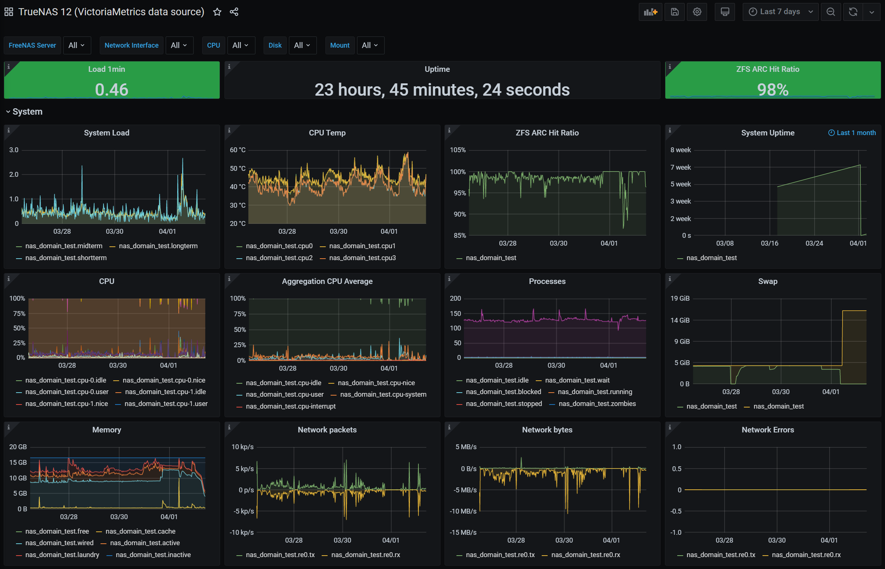

# Grafana TrueNAS dashboard

A Grafana dashboard for FreeNAS / TrueNAS 12 metrics using a VictoriaMetrics (Prometheus) backend.

This is a direct conversion of <a href="https://github.com/okolbu/grafana-dashboards">okolbu's dashboard</a> (which uses a Graphite datasource).

  

